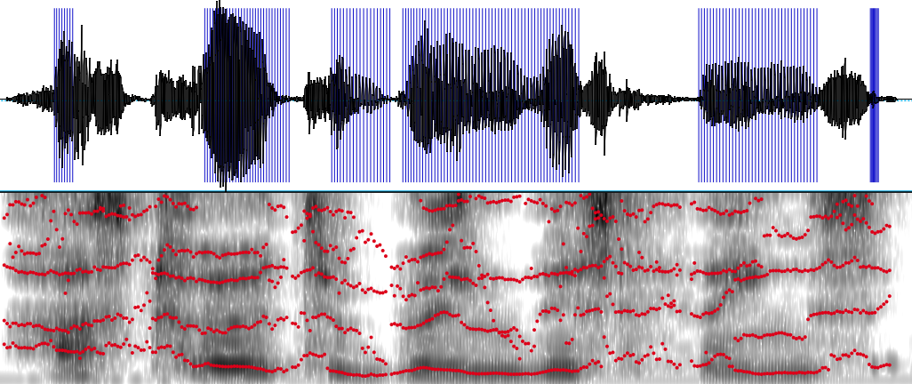
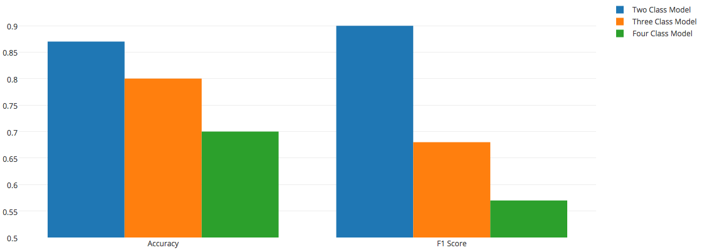

# Accent Inspector

Accent Inspector is your solution to automated accent detection. Accent Inspector can determine whether an individual is a native English speaker based on their speech. All you need is a recording of the person in question reading the following phrase:

"Please call Stella, ask her to bring these things with her from the store."

Accent Inspector classifies the person as either a native or a non-native English speaker using formant analysis and a Support Vector Machine. Applications for this include identifying customer types and providing targeted customer service and marketing.

## Understanding the Model

The objective of this project was to answer the following question:

Can an algorithm detect the accent of a speaker?

The human ear easily notices when an unfamiliar accent is present. Accent Detector attempts to use the same differences in sound that the human ear focuses on and deliver an accurate label for whether a given speaker has an accent.

### The Data

A database of over 1500 audio files from [The Speech Accent Archive](http://accent.gmu.edu/) was used to train the model. These files contain recordings of speakers with 39 different native languages, and all of them are reading the same transcript. This gives the dataset the consistency needed to conservatively test the hypothesis.

The model relies on analysis of formant data to make predictions. Formants are frequencies in sound waves from speech that are amplified due to the size and shapes of certain cavities in the speakers vocal tract. The first formant comes from the back of the throat, the second from the front of the mouth, and so on. A free linguistics software named [Praat](http://www.fon.hum.uva.nl/praat/) was used to extract the formant data.

Waveform and spectrogram from Praat with labeled formants (in red) and pulses (in blue)

### The Model

Accent detector uses a Support Vector Machine to make predictions based on formant data. The analysis uses first 4 formants of the first 12 words from each audio file. These allow the model to classify the speaker as either a native English speaker, or a non-native English, non-Indo-European speaker. Several tests sets have been run through the model and the accuracy is consitantly above 85%, while the F1 score for the native English speaking class is almost 90%.

### Insights

The results are reasonably auspicious, considering the subtleties in the formant differences across accents and the amount of data used. Accent Analyzer could be used in real-time if integrated with Praat or another software that can extract the formant data from audio feed. The model did not perform well on more difficult problems, but these are likely solvable with further data and research.

A much larger dataset would allow the model both to classify between more specific accent groups and to classify between groups that are similar to each other. The model was attempted with four language families and was only able to select with an F1 score of about 57%. Most of the observations were in the European family, the maximum observations in any one of the other groups was below 200. This just was not enough to accurately make decisions with the SVM. More data would give the model the chance to pick up on the subtle differences between each of these accent families.

F1 Score drops off significantly when the model attempts to classify between more than two groups

The model also required that each subject read the same transcript as the speakers in the database. This would be resolved with more accurate labeling of the words from each speaker as well as more data. Each audio file was divided into words (or more specifically, the vowel sounds for each word), using pulse analysis from Praat. This worked fairly well, but would sometimes pick up sounds that were not words as well as lump two words together. This is evidenced by the fact that the model performed best using only the first 12 words when there were actually 69 words in the transcript. The 13th word in each recording was too varied to be useful. The model could be adapted to determine accents based off any words if more words were used and a labeled accurately using an additional algorithm.

Despite the above setbacks, the results from classifying native English against all non-European speakers proves the feasibility of expanding upon the model to work under more complicated circumstances.

## Using the Model

This repo contains the code for recreating the inspector. The data folder contains .txt files precompiled for training the model. To use the data files and run the model, follow the Quickstart Setup instructions. To scrape and format the data yourself, follow the Full Setup instructions (this will require downloading a third-party software). All scripts are located in the code folder.

### Files Included

code/..  
*    **scrape_data.py** - scrapes the mp3 files from the online archive 
*    **get_formants_pulses.praat** - extracts formant and pulse info from mp3s using Praat
*    **mongo_setup.py** - populates a mongoDB database with the data
*    **basic_models.py** - runs the model and returns results
*    **pulse_analysis.py** - finds formant data for each word using the pulse data to partition (used by mongo_setup.py)
*    **undersample.py** - contains code for undersampling and smoting, both are additional options in the model (used by basic_models.py)
*    **uniformity.py** - scales the formant dat so that the number of datapoints is uniform across all words (used by basic_models.py)
*    **cross_validate.py** - divides data and performs k-fold cross validation to return the average of each metric across each fold (used by basic_models.py)

data/..  
*    **afroasiatic** - formant and pulse files for accents in the Afroasiatic language family  
*    **european** - formant and pulse files for the European language family  
*    **indo_iranian** - formant and pulse files for the Indo-Iranian language family  
*    **sino_tibetan** - formant and pulse files for the Sino-Tibetan language family  

### Quickstart Setup

This setup utilizes the data files available in the data folder. If you prefer to run through the entire experiment, including scraping and extracting the data, please refer to the Full Setup. This will require you to install Praat, a free software.

**Step 1:** Run mongo_setup.py

This will prepare the mongoDB database using the formant and pulse files in the data folder. The database saves all available information on the speakers and saves a list of all words with additional information on each word. Many of this information is not used in the final model but could be useful for additional research.

**Step 2:** Run basic_models.py

This will build and test the model. The model outputs accuracy and F1 scores.

### Full Setup

**Step 1:** Run scrape_data.py

This will scrape the mp3 files for analysis. We will save native language, birth country, and gender as well for use in further analysis. The data source is [The Speech Accent Archive](http://accent.gmu.edu/), a free accent database.

**Step 2:** Download Praat

Praat is a free linguistic software and is necessary for Accent Inspector to extract the data required to make predictions. We will be using the formant and pulse data that Praat derives from our audio files. Go to the [Praat homepage](http://www.fon.hum.uva.nl/praat/) to download.

**Step 3:** Run get_formants_pulses.praat

The file will need to be in the same folder as the audio files you have downloaded. It may be best to place a copy of the file in each directory where files are stored. You will also need to edit the input and output directories in the file, so that they match the desired input and output locations on your computer. Be sure that Praat is set as the default application for files of this type and open the file. You may need to click 'Run' in Praat, and Praat will begin scraping the formant and pulse data for the first 20 seconds of each audio file in .txt files.

**Step 4:** Run mongo_setup.py

This will prepare the mongoDB database using the formant and pulse files in the data folder. The database saves all available information on the speakers and saves a list of all words with additional information on each word. Many of this information is not used in the final model but could be useful for additional research.

**Step 5:** Run basic_models.py

This will build and test the model. The model outputs accuracy and F1 scores.
